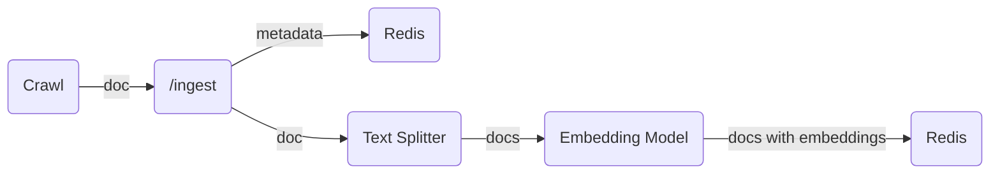
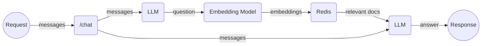

# chat-search


[](https://artifacthub.io/packages/search?repo=chat-search)

Chat with documents, search via natural language.

`chat-search` supports hybrid language models to add chat capabilities to website.
RAG built with LangChain, Redis, various model providers (OpenAI, Ollama, vLLM, Huggingface).

Demo: [Chat about my blog](https://hemslo.io/chat/)

## Usage

### Setup .env

```shell
cp .env.example .env
```

Populate `.env` file with the required environment variables.

| Name                              | Value                                                                               | Default                           |
|-----------------------------------|-------------------------------------------------------------------------------------|-----------------------------------|
| AUTH_TOKEN                        | auto token used for ingest                                                          |                                   |
| CHAT_PROVIDER                     | model provider, `openai` or `ollama`                                                | `openai`                          |
| DEBUG                             | enable DEBUG, `1` or `0`                                                            | `0`                               |
| DIGEST_PREFIX                     | prefix for digest in Redis                                                          | `digest`                          |
| ENABLE_FEEDBACK_ENDPOINT          | enable feedback endpoint, `1` or `0`                                                | `1`                               |
| ENABLE_PUBLIC_TRACE_LINK_ENDPOINT | enable public trace link endpoint, `1` or `0`                                       | `1`                               |
| EMBEDDING_DIM                     | embedding dimensions                                                                | `1536`                            |
| EMBEDDING_PROVIDER                | embedding provider, `openai` or `ollama` or `huggingface`                           | `openai`                          |
| HEADERS_TO_SPLIT_ON               | html headers to split text                                                          | `h1,h2,h3`                        |
| HF_HUB_EMBEDDING_MODEL            | huggingface hub embedding model or Text Embeddings Inference url                    | `http://localhost:8080`           |
| INDEX_NAME                        | index name                                                                          | `document`                        |
| INDEX_SCHEMA_PATH                 | index schema path                                                                   | (will use `app/schema.yaml`)      |
| MERGE_SYSTEM_PROMPT               | merge system prompt with user input, for models not support system role, `1` or `0` | `0`                               |
| LANGCHAIN_API_KEY                 | langchain api key for langsmith                                                     |                                   |
| LANGCHAIN_ENDPOINT                | langchain endpoint for langsmith                                                    | `https://api.smith.langchain.com` |
| LANGCHAIN_PROJECT                 | langchain project for langsmith                                                     | `default`                         |
| LANGCHAIN_TRACING_V2              | enable langchain tracing v2                                                         | `true`                            |
| LLM_TEMPERATURE                   | temperature for LLM                                                                 | `0`                               |
| OLLAMA_CHAT_MODEL                 | ollama chat model                                                                   | `gemma`                           |
| OLLAMA_EMBEDDING_MODEL            | ollama embedding model                                                              | `nomic-embed-text`                |
| OLLAMA_URL                        | ollama url                                                                          | `http://localhost:11434`          |
| OPENAI_API_BASE                   | openai compatible api base url                                                      |                                   |
| OPENAI_API_KEY                    | openai api key                                                                      | `EMPTY`                           |
| OPENAI_CHAT_MODEL                 | openai chat model                                                                   | `gpt-3.5-turbo`                   |
| OPENAI_EMBEDDING_MODEL            | openai embedding model                                                              | `text-embedding-3-small`          |
| OTEL_SDK_DISABLED                 | disable OpenTelemetry, `false` or `true`                                            | `false`                           |
| OTEL_SERVICE_NAME                 | OpenTelemetry service name, also used for Pyroscope application name                | `chat-search`                     |
| PYROSCOPE_BASIC_AUTH_PASSWORD     | Pyroscope basic auth password                                                       |                                   |
| PYROSCOPE_BASIC_AUTH_USERNAME     | Pyroscope basic auth username                                                       |                                   |
| PYROSCOPE_SERVER_ADDRESS          | Pyroscope server address                                                            | `http://localhost:4040`           |
| PYROSCOPE_ENABLED                 | Enable Pyroscope or not, `1` or `0`                                                 | `1`                               |
| REDIS_URL                         | redis url                                                                           | `redis://localhost:6379/`         |
| REPHRASE_PROMPT                   | prompt for rephrase                                                                 | check [config.py](/app/config.py) |
| RETRIEVAL_QA_CHAT_SYSTEM_PROMPT   | prompt for retrieval                                                                | check [config.py](/app/config.py) |
| RETRIEVER_SEARCH_KWARGS           | search kwargs for redis retriever as json                                           | check [config.py](/app/config.py) |
| RETRIEVER_SEARCH_TYPE             | search type for redis retriever                                                     | `mmr`                             |
| TEXT_SPLIT_CHUNK_OVERLAP          | chunk overlap for text split                                                        | `200`                             |
| TEXT_SPLIT_CHUNK_SIZE             | chunk size for text split                                                           | `4000`                            |
| VERBOSE                           | enable verbose, `1` or `0`                                                          | `0`                               |

### Start Ollama (Optional)

Follow [Ollama instructions](https://github.com/ollama/ollama)

```shell
ollama serve
ollama pull gemma
ollama pull nomic-embed-text
```

### Run on host

#### Install dependencies

```shell
pip install poetry==1.7.1
poetry shell
poetry install
```

#### Start dependencies

Start redis

```shell
docker compose -f compose.redis.yaml up
```

#### Launch LangServe

```bash
langchain serve
```

Visit http://localhost:8000/

### Run in Docker

There is a `compose.yml` file for running the app and all dependencies in containers.
Suitable for local end to end testing.

```shell
docker compose up --build
```

Visit http://localhost:8000/

### Run in Kubernetes

There is a `helm` chart for deploying the app in Kubernetes.

#### Config Helm values

#### Using Helm

```shell
cp values.example.yaml values.yaml
```

Then update `values.yaml` accordingly.

Add helm repos:

```shell
helm repo add chat-search https://hemslo.github.io/chat-search/
helm repo add redis-stack https://redis-stack.github.io/helm-redis-stack/
helm repo add ollama-helm https://otwld.github.io/ollama-helm/
```

Install/Upgrade chat-search

```shell
helm upgrade -i --wait my-chat-search chat-search/chat-search -f values.yaml
```

#### Using Skaffold for local development

```shell
skaffold run --port-forward
```

## Ingest data

```shell
crawl --sitemap-url $SITEMAP_URL --auth-token $AUTH_TOKEN
```

Check [crawl.yml](.github/workflows/crawl.yml) for web crawling,

Example auto ingest after Github Pages deploy,
[jekyll.yml](https://github.com/hemslo/hemslo.github.io/blob/master/.github/workflows/jekyll.yml).

## Architecture

### Ingest



### Query



## Deployment

Check [cicd.yml](.github/workflows/cicd.yml) for Google Cloud Run deployment,
[deploy-to-cloud-run](https://github.com/marketplace/actions/deploy-to-cloud-run).
