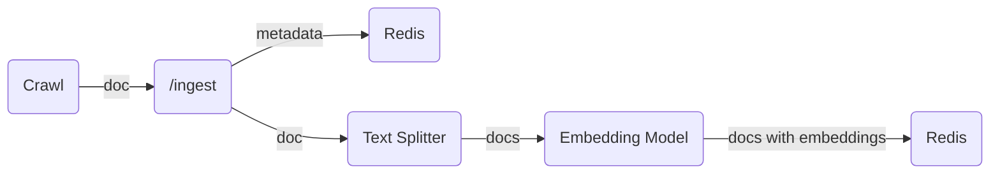
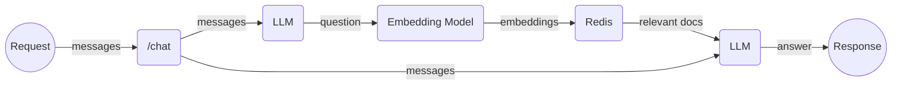

# chat-search


Chat with documents, search via natural language.

Demo: [Chat about my blog](https://hemslo.io/chat/)

## Usage

### Setup .env

```shell
cp .env.example .env
```

Populate `.env` file with the required environment variables.

| Name                              | Value                                         | Default                           |
|-----------------------------------|-----------------------------------------------|-----------------------------------|
| AUTH_TOKEN                        | auto token used for ingest                    |                                   |
| CHAT_PROVIDER                     | model provider, `openai` or `ollama`          | `openai`                          |
| DEBUG                             | enable DEBUG, `1` or `0`                      | `0`                               |
| DIGEST_PREFIX                     | prefix for digest in Redis                    | `digest`                          |
| ENABLE_FEEDBACK_ENDPOINT          | enable feedback endpoint, `1` or `0`          | `1`                               |
| ENABLE_PUBLIC_TRACE_LINK_ENDPOINT | enable public trace link endpoint, `1` or `0` | `1`                               |
| EMBEDDING_DIM                     | embedding dimensions                          | `1536`                            |
| EMBEDDING_PROVIDER                | embedding provider, `openai` or `ollama`      | `openai`                          |
| HEADERS_TO_SPLIT_ON               | html headers to split text                    | `h1,h2,h3`                        |
| INDEX_NAME                        | index name                                    | `document`                        |
| INDEX_SCHEMA_PATH                 | index schema path                             | (will use `app/schema.yaml`)      |
| LANGCHAIN_API_KEY                 | langchain api key for langsmith               |                                   |
| LANGCHAIN_ENDPOINT                | langchain endpoint for langsmith              | `https://api.smith.langchain.com` |
| LANGCHAIN_PROJECT                 | langchain project for langsmith               | `default`                         |
| LANGCHAIN_TRACING_V2              | enable langchain tracing v2                   | `true`                            |
| LLM_TEMPERATURE                   | temperature for LLM                           | `0`                               |
| OLLAMA_CHAT_MODEL                 | ollama chat model                             | `gemma`                           |
| OLLAMA_EMBEDDING_MODEL            | ollama embedding model                        | `nomic-embed-text`                |
| OLLAMA_URL                        | ollama url                                    | `http://localhost:11434`          |
| OPENAI_API_KEY                    | openai api key                                |                                   |
| OPENAI_CHAT_MODEL                 | openai chat model                             | `gpt-3.5-turbo`                   |
| OPENAI_EMBEDDING_MODEL            | openai embedding model,                       | `text-embedding-3-small`          |
| REDIS_URL                         | redis url                                     | `redis://localhost:6379/`         |
| REPHRASE_PROMPT                   | prompt for rephrase                           | check [config.py](/app/config.py) |
| RETRIEVAL_QA_CHAT_SYSTEM_PROMPT   | prompt for retrieval                          | check [config.py](/app/config.py) |
| RETRIEVER_SEARCH_KWARGS           | search kwargs for redis retriever as json     | check [config.py](/app/config.py) |
| RETRIEVER_SEARCH_TYPE             | search type for redis retriever               | `mmr`                             |
| TEXT_SPLIT_CHUNK_OVERLAP          | chunk overlap for text split                  | `200`                             |
| TEXT_SPLIT_CHUNK_SIZE             | chunk size for text split                     | `4000`                            |
| VERBOSE                           | enable verbose, `1` or `0`                    | `0`                               |

### Start Ollama (Optional)

Follow [Ollama instructions](https://github.com/ollama/ollama)

```shell
ollama serve
ollama pull gemma
ollama pull nomic-embed-text
```

### Run on host

#### Install dependencies

```shell
pip install poetry==1.7.1
poetry shell
poetry install
```

#### Start dependencies

Start redis

```shell
docker compose -f compose.redis.yaml up
```

#### Launch LangServe

```bash
langchain serve
```

Visit http://localhost:8000/

### Run in Docker

```shell
docker compose up --build
```

Visit http://localhost:8000/

## Ingest data

```shell
crawl --sitemap-url $SITEMAP_URL --auth-token $AUTH_TOKEN
```

Check [crawl.yml](.github/workflows/crawl.yml) for web crawling,

Example auto ingest after Github Pages deploy,
[jekyll.yml](https://github.com/hemslo/hemslo.github.io/blob/master/.github/workflows/jekyll.yml).

## Architecture

### Ingest



### Query



## Deployment

Check [cicd.yml](.github/workflows/cicd.yml) for Google Cloud Run deployment,
[deploy-to-cloud-run](https://github.com/marketplace/actions/deploy-to-cloud-run).
